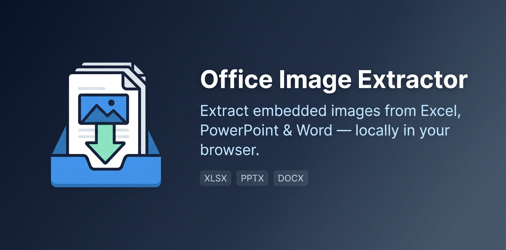

# Office Image Extractor


A self-contained, offline utility for extracting embedded images from Microsoft Excel, PowerPoint, and Word files—delivered as **one HTML file**.

Open the file in a modern browser, drop Office files, and download all embedded images as one ZIP archive. No installation, build step, server, CDN, or network connection is required.


## Try it online

Open the hosted app:  
[https://ttomohisa.github.io/htmlapps-office-image-extractor/office-image-extractor.html](https://ttomohisa.github.io/htmlapps-office-image-extractor/office-image-extractor.html)

Your files stay in your browser. Nothing is uploaded.

## Why

Office documents often contain screenshots, diagrams, photos, and other original image assets that need to be recovered quickly.

This tool is intended for simple and restricted environments: locked-down workstations, air-gapped networks, internal support work, document migration, and quick asset recovery.

- **Single-file distribution** — copy one HTML file anywhere
- **Offline and private** — files stay in your browser
- **No installation** — open it directly in a modern browser
- **No runtime dependencies** — scripts and styles, including JSZip, are embedded
- **Original image bytes** — extracted images are not recompressed or converted
- **Japanese / English UI** — follows the shared `htmlapps-template` visual language

## Features

- Open one or many Office files from the picker or with drag and drop
- Extract embedded images from Excel, PowerPoint, and Word files
- Process multiple documents in a single operation
- Wait for every selected document to finish inspection before enabling ZIP download
- Limit simultaneous Office-package inspection to reduce peak memory pressure
- Skip duplicate selections and report unsupported files instead of silently ignoring them
- Clear the current selection without reloading the page
- Preserve original image filenames and file extensions where possible
- Preserve original image data without screenshotting, rendering, or recompression
- Download all extracted assets as one ZIP archive
- Organize ZIP output by source-document filename
- Avoid duplicate output paths when several documents contain equally named images
- Show the image count and extraction status for every selected file
- Explain unsupported, encrypted, corrupted, or invalid files in clear language
- Run locally with no upload, server, account, telemetry, or network request

## Quick start

1. Download [`office-image-extractor.html`](./office-image-extractor.html) from this repository.
2. Open it in a current Chromium-based browser, Firefox, or Safari.
3. Choose Office files or drag them into the drop area.
4. Wait until the tool reports the discovered image count.
5. Click **Download extracted images (.zip)**.

There is no upload. Selected files remain local to your browser session.

## How it works

Modern Microsoft Office files use the Office Open XML format, which is a ZIP package containing XML files, media, and other document parts.

This app reads the original media entries directly from the local package:

| Source application | Image folder inside the Office package |
|---|---|
| Excel | `xl/media/` |
| PowerPoint | `ppt/media/` |
| Word | `word/media/` |

The extracted images are packaged into a new ZIP archive with this layout:

```text
extracted-office-images.zip
├── quarterly-report/
│   ├── image1.png
│   ├── image2.jpeg
│   └── image3.emf
├── project-slides/
│   ├── image1.png
│   └── image2.jpg
└── proposal/
    └── image1.png
```

The source Office document is never uploaded or sent to a server.

## Supported formats

| Item | Support |
|---|---|
| Excel | `.xlsx`, `.xlsm`, `.xltx`, `.xltm` |
| PowerPoint | `.pptx`, `.pptm`, `.potx`, `.potm`, `.ppsx`, `.ppsm` |
| Word | `.docx`, `.docm`, `.dotx`, `.dotm` |
| Input | Local files selected with the browser picker or drag and drop |
| Output | One ZIP archive containing extracted image files |
| Network | Not required; designed to run offline |
| Image handling | Original embedded image data is copied without conversion |

## Limitations

This app supports **modern Office Open XML** documents only.

| Not supported | Reason |
|---|---|
| `.xls`, `.ppt`, `.doc` | Legacy binary Office formats are not Office Open XML ZIP packages |
| Password-protected files | The browser app cannot open encrypted Office packages |
| Corrupted or incomplete files | The original ZIP package must be valid and readable |
| Images linked from external locations | Only images embedded in the Office package can be extracted |
| Rendered page appearance | This tool extracts original media files; it does not render document pages or slides |

Some Office files can include uncommon image formats such as EMF, WMF, SVG, TIFF, or GIF. The app extracts those original files, but whether they can be previewed depends on your operating system and installed applications.

## Privacy

Office Image Extractor is designed to be private by default.

- Files are processed entirely in the browser.
- Files are not uploaded.
- No document contents are stored by the app.
- Reloading or closing the browser removes the in-memory session.
- The distributable HTML includes its runtime dependency, so it does not need to contact a CDN.

## Development

The distributable is deliberately a single, self-contained HTML file.

If you modify it directly, keep these principles intact:

- Do not add external CDN or network dependencies.
- Keep all runtime scripts and styles embedded.
- Keep user files local; do not add uploads, analytics, telemetry, or remote logging.
- Test Excel, PowerPoint, and Word input separately.
- Test documents with no images, one image, many images, and duplicate image filenames.
- Test drag and drop, the file picker, multi-file input, duplicate selections, mixed supported/unsupported input, and ZIP download flows.
- Test that ZIP download stays disabled until all selected files finish inspection.
- Test on a network-disabled machine or browser profile.

Run the lightweight source check before committing:

```bash
node scripts/check-source.mjs
```

The check verifies that the distributable stays self-contained and that the reliability guards expected by this repository are present.

## License and notices

Copyright (c) 2026 Tomohisa Takagi

This project is licensed under the [MIT License](LICENSE).

The distributable HTML contains third-party license notices. The same notices
are also available in
[THIRD-PARTY-NOTICES.txt](THIRD-PARTY-NOTICES.txt).

The distributable embeds **JSZip v3.10.1**, which is dual-licensed under the
MIT License or GPLv3. This project uses JSZip under the MIT License. JSZip
includes or uses **pako** for DEFLATE compression and decompression support.
Keep the applicable copyright and license notices when distributing modified
or bundled copies.

Microsoft, Excel, PowerPoint, Word, and Office are trademarks of the Microsoft group of companies.

This project is independent and is not affiliated with, endorsed by, or sponsored by Microsoft.

## Third-party acknowledgements

- [JSZip](https://github.com/Stuk/jszip) — ZIP reading and creation in the browser, MIT License or GPLv3
- [pako](https://github.com/nodeca/pako) — DEFLATE compression and decompression support, MIT License

## Contributing

Bug reports and improvements are welcome.

When reporting a problem, please include:

- Browser name and version
- Operating system
- Office file type, for example `.pptx` or `.xlsx`
- Whether the file is encrypted or generated by a third-party tool
- A minimal synthetic reproduction, if possible

Please remove sensitive data before sharing Office documents.